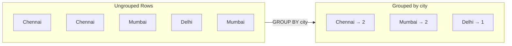
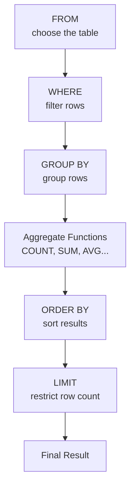

# 🐬 MySQL Practice

A collection of **MySQL practice programs and SQL queries** created while learning and practicing database concepts.

This repository contains SQL examples covering `SELECT`, `WHERE`, `GROUP BY`, aggregate functions, `ORDER BY`, `LIMIT`, and basic table operations using employee and student data.

---

## 📚 Table of Contents

- [About This Repository](#-about-this-repository)
- [SQL Topics Covered](#-sql-topics-covered)
- [Repository Files](#-repository-files)
- [SELECT Query and WHERE Clause](#-select-query-and-where-clause)
- [Aggregate Functions](#-aggregate-functions)
- [GROUP BY Clause](#-group-by-clause)
- [ORDER BY and LIMIT](#-order-by-and-limit)
- [SQL Query Execution Order](#-sql-query-execution-order)
- [Employee Table](#-employee-table)
- [Student Table](#-student-table)
- [Basic SQL Examples](#-basic-sql-examples)
- [SQL Learning Flow](#-sql-learning-flow)
- [Technologies Used](#-technologies-used)
- [Learning Goals](#-learning-goals)
- [Future Topics](#-future-topics)
- [Author](#-author)

---

## 🧠 About This Repository

This repository is part of my journey to learn **SQL and MySQL**.

The practice files contain different SQL queries that help me understand how to retrieve, filter, group, sort, and analyze data stored in relational database tables.

The repository currently contains practice files for:

- SELECT queries
- WHERE clause
- Aggregate functions
- GROUP BY
- ORDER BY
- LIMIT
- Employee data
- Student data

---

## 📚 SQL Topics Covered

| Topic | Purpose |
|---|---|
| `SELECT` | Retrieve data from a table |
| `WHERE` | Filter records |
| Aggregate Functions | Perform calculations on data |
| `GROUP BY` | Group records based on a column |
| `ORDER BY` | Sort query results |
| `LIMIT` | Restrict the number of returned rows |
| Tables | Store structured data |
| Conditions | Filter specific records |

---

## 📂 Repository Files

The repository contains the following SQL practice files:

| 📄 File | 📝 Description |
|---|---|
| `Aggregate functions.sql` | Practice queries using aggregate functions |
| `Group By Clause.sql` | Practice queries using the GROUP BY clause |
| `Limit abd Order By clause.sql` | Practice using LIMIT and ORDER BY |
| `employee.sql` | Employee table and related SQL practice |
| `select query and where clause.sql` | SELECT queries and WHERE conditions |
| `student.sql` | Student table and related SQL practice |

---

## 🔎 SELECT Query and WHERE Clause

The `SELECT` statement is used to retrieve data from a database table.

### Basic Example

```sql
SELECT *
FROM students;
```

This retrieves all columns and records from the `students` table.

### Selecting Specific Columns

```sql
SELECT student_name, city
FROM students;
```

### Using WHERE

The `WHERE` clause is used to filter records.

```sql
SELECT *
FROM students
WHERE city = 'Chennai';
```

This returns only the students whose city is Chennai.

---

## 📊 Aggregate Functions

Aggregate functions perform calculations on multiple rows and return a single result.

Common aggregate functions include:

| Function | Purpose |
|---|---|
| `COUNT()` | Counts rows or values |
| `SUM()` | Calculates the total |
| `AVG()` | Calculates the average |
| `MIN()` | Finds the minimum value |
| `MAX()` | Finds the maximum value |

### Example

```sql
SELECT COUNT(*)
FROM employee;
```

### SUM Example

```sql
SELECT SUM(salary)
FROM employee;
```

### AVG Example

```sql
SELECT AVG(salary)
FROM employee;
```

### MIN Example

```sql
SELECT MIN(salary)
FROM employee;
```

### MAX Example

```sql
SELECT MAX(salary)
FROM employee;
```

---

## 🗂️ GROUP BY Clause

The `GROUP BY` clause groups rows that have the same values in specified columns.

### Visual Grouping



### Example

```sql
SELECT city, COUNT(*)
FROM customers
GROUP BY city;
```

This groups customers according to their city.

### GROUP BY with an Aggregate Function

```sql
SELECT department, COUNT(*)
FROM employee
GROUP BY department;
```

This returns the number of employees in each department.

---

## 🔽 ORDER BY and LIMIT

### ORDER BY

`ORDER BY` is used to sort query results.

### Ascending Order

```sql
SELECT *
FROM employee
ORDER BY salary ASC;
```

### Descending Order

```sql
SELECT *
FROM employee
ORDER BY salary DESC;
```

### LIMIT

`LIMIT` restricts the number of rows returned.

```sql
SELECT *
FROM employee
LIMIT 5;
```

This returns only the first five records.

### ORDER BY with LIMIT

```sql
SELECT *
FROM employee
ORDER BY salary DESC
LIMIT 3;
```

This can be used to find the top three highest salaries.

---

## 🔄 SQL Query Execution Order

SQL reads top to bottom, but the database actually **runs** the clauses in a different order behind the scenes:



Understanding this order helps explain why, for example, `WHERE` can't filter on an aggregate result but a `HAVING` clause (a future topic) can.

---

## 👨‍💼 Employee Table

The `employee.sql` file is used for practicing SQL queries with employee-related data.

Typical SQL practice can include:

- Selecting employees
- Filtering employees
- Sorting employees
- Counting employees
- Finding salary values
- Grouping employees
- Finding maximum and minimum salaries

### Example

```sql
SELECT *
FROM employee;
```

---

## 🎓 Student Table

The `student.sql` file is used for practicing SQL queries with student-related data.

Queries can be used to:

- Retrieve student records
- Filter students
- Sort students
- Count students
- Group students
- Analyze student information

### Example

```sql
SELECT *
FROM student;
```

---

## 💻 Basic SQL Examples

### Select All Records
