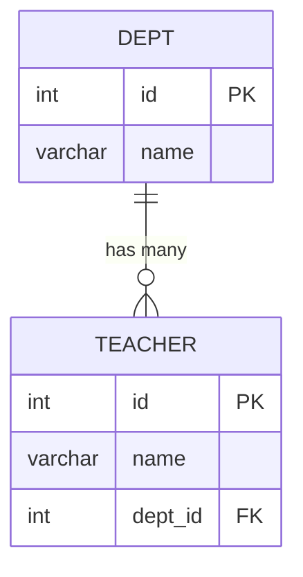
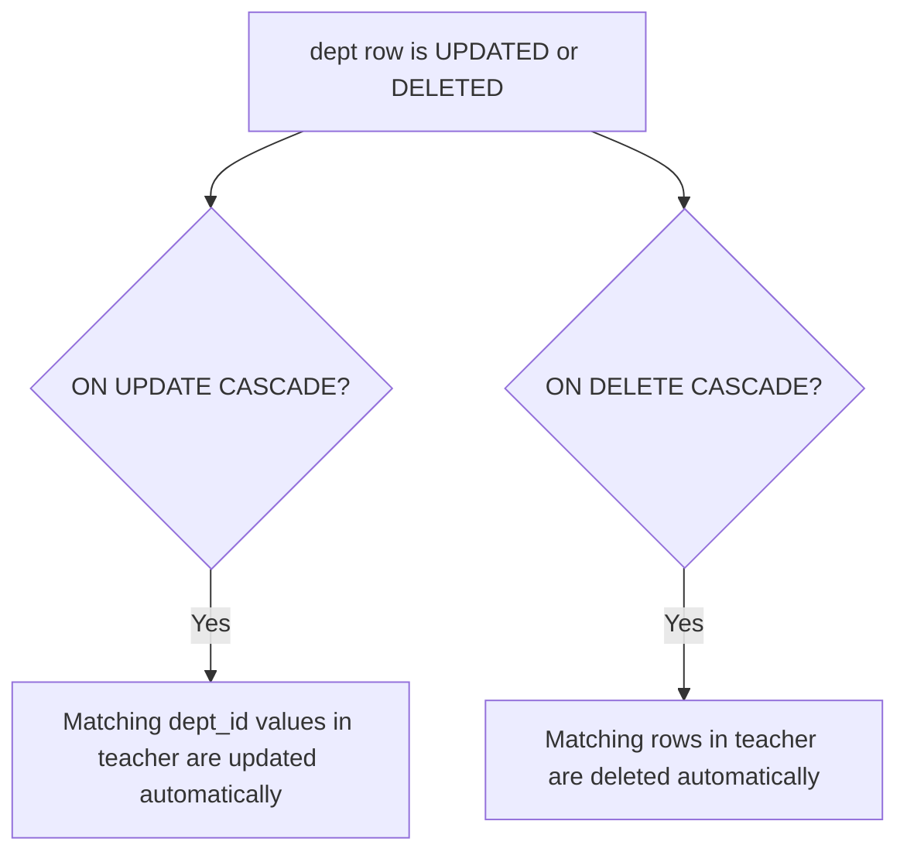

# 🐬 MySQL Practice

A collection of MySQL and SQL practice programs created while learning database concepts and writing SQL queries.

This repository contains practice with SELECT, WHERE, aggregate functions, GROUP BY, ORDER BY, LIMIT, UPDATE, DELETE, foreign keys, and cascading operations.

---

## 📚 Table of Contents

- [About This Repository](#-about-this-repository)
- [SQL Topics Covered](#-sql-topics-covered)
- [Repository Files](#-repository-files)
- [SELECT Query and WHERE Clause](#-select-query-and-where-clause)
- [Aggregate Functions](#-aggregate-functions)
- [GROUP BY Clause](#-group-by-clause)
- [ORDER BY and LIMIT](#-order-by-and-limit)
- [UPDATE and DELETE](#-update-and-delete)
- [Foreign Keys and Cascading](#-foreign-keys-and-cascading)
- [Employee Table](#-employee-table)
- [Student Table](#-student-table)
- [Basic SQL Examples](#-basic-sql-examples)
- [SQL Learning Flow](#-sql-learning-flow)
- [Technologies Used](#-technologies-used)
- [Learning Goals](#-learning-goals)
- [Future Topics](#-future-topics)
- [Author](#-author)

---

## 🧠 About This Repository

This repository is part of my journey to learn SQL, MySQL, and Database Management.

The practice files contain different SQL queries that help me understand how to create, retrieve, filter, update, delete, group, and sort data stored in relational database tables.

The repository currently contains practice with:

- SELECT queries
- WHERE clause
- Aggregate functions
- GROUP BY
- ORDER BY
- LIMIT
- UPDATE
- DELETE
- Foreign Keys
- Cascading updates and deletes
- Employee data
- Student data

---

## 📚 SQL Topics Covered

| Topic | Purpose |
|---|---|
| SELECT | Retrieve data from a table |
| WHERE | Filter records |
| COUNT() | Count records |
| SUM() | Calculate totals |
| AVG() | Calculate averages |
| MIN() | Find minimum values |
| MAX() | Find maximum values |
| GROUP BY | Group records |
| ORDER BY | Sort query results |
| LIMIT | Restrict returned rows |
| UPDATE | Modify existing records |
| DELETE | Remove records |
| FOREIGN KEY | Create relationships between tables |
| ON UPDATE CASCADE | Automatically update related foreign key values |
| ON DELETE CASCADE | Automatically delete related records |

---

## 📂 Repository Files

The repository currently contains these SQL files:

| File | Description |
|---|---|
| `Aggregate functions.sql` | Practice with SQL aggregate functions |
| `Group By Clause.sql` | Practice with the GROUP BY clause |
| `Limit abd Order By clause.sql` | Practice with LIMIT and ORDER BY |
| `Update_delete and Cascading_FK.sql` | Practice with UPDATE, DELETE, foreign keys, and cascading |
| `employee.sql` | Employee table and SQL practice |
| `select query and where clause.sql` | SELECT queries and WHERE conditions |
| `student.sql` | Student table and SQL practice |

---

## 🔎 SELECT Query and WHERE Clause

The SELECT statement is used to retrieve information from a table.

### Select All Columns

```sql
SELECT *
FROM student;
```

### Select Specific Columns

```sql
SELECT student_name, city
FROM student;
```

### Using WHERE

The WHERE clause filters records based on a condition.

```sql
SELECT *
FROM student
WHERE city = 'Chennai';
```

---

## 📊 Aggregate Functions

Aggregate functions perform calculations on multiple rows.

Common aggregate functions include:

- COUNT()
- SUM()
- AVG()
- MIN()
- MAX()

### COUNT

```sql
SELECT COUNT(*)
FROM employee;
```

### SUM

```sql
SELECT SUM(salary)
FROM employee;
```

### AVG

```sql
SELECT AVG(salary)
FROM employee;
```

### MIN

```sql
SELECT MIN(salary)
FROM employee;
```

### MAX

```sql
SELECT MAX(salary)
FROM employee;
```

---

## 🗂️ GROUP BY Clause

GROUP BY groups rows that have the same value in a particular column.

### Example

```sql
SELECT city, COUNT(*)
FROM student
GROUP BY city;
```

### GROUP BY with Aggregate Function

```sql
SELECT department, COUNT(*)
FROM employee
GROUP BY department;
```

---

## 🔽 ORDER BY and LIMIT

ORDER BY is used to sort results.

### Ascending Order

```sql
SELECT *
FROM employee
ORDER BY salary ASC;
```

### Descending Order

```sql
SELECT *
FROM employee
ORDER BY salary DESC;
```

### LIMIT

```sql
SELECT *
FROM employee
LIMIT 5;
```

### ORDER BY with LIMIT

```sql
SELECT *
FROM employee
ORDER BY salary DESC
LIMIT 3;
```

---

## ✏️ UPDATE and DELETE

### UPDATE

UPDATE is used to modify existing records.

```sql
UPDATE employee
SET salary = 50000
WHERE id = 101;
```

The WHERE condition identifies which record should be changed.

### DELETE

DELETE is used to remove records.

```sql
DELETE FROM employee
WHERE id = 101;
```

Always use a suitable WHERE condition when deleting specific records.

---

## 🔗 Foreign Keys and Cascading

A FOREIGN KEY creates a relationship between two tables.

### Visual Relationship



Example:

```sql
CREATE TABLE teacher(
    id INT PRIMARY KEY,
    name VARCHAR(50),
    dept_id INT,
    FOREIGN KEY (dept_id) REFERENCES dept(id)
);
```

### ON UPDATE CASCADE

When the referenced primary key is changed, related foreign key values can automatically be updated.

```sql
FOREIGN KEY (dept_id)
REFERENCES dept(id)
ON UPDATE CASCADE
```

### ON DELETE CASCADE

When a referenced record is deleted, related records can automatically be deleted.

```sql
FOREIGN KEY (dept_id)
REFERENCES dept(id)
ON DELETE CASCADE
```

### How Cascading Flows



These concepts help maintain relationships between related tables.

---

## 👨‍💼 Employee Table

The `employee.sql` file is used for practicing SQL queries with employee-related data.

Practice can include:

- Selecting employee records
- Filtering employees
- Sorting employees
- Counting employees
- Calculating salary values
- Grouping employees
- Finding minimum and maximum salaries
- Updating employee information
- Deleting employee records

Example:

```sql
SELECT *
FROM employee;
```

---

## 🎓 Student Table

The `student.sql` file is used for practicing SQL queries with student-related data.

Practice can include:

- Selecting student records
- Filtering students
- Sorting students
- Counting students
- Grouping students
- Analyzing student information

Example:

```sql
SELECT *
FROM student;
```

---

## 💻 Basic SQL Examples

### Select All Records

```sql
SELECT *
FROM employee;
```

### Select Specific Columns

```sql
SELECT employee_name, salary
FROM employee;
```

### Filter Records

```sql
SELECT *
FROM employee
WHERE salary > 30000;
```

### Sort Records

```sql
SELECT *
FROM employee
ORDER BY salary DESC;
```

### Count Records

```sql
SELECT COUNT(*)
FROM employee;
```

### Group Records

```sql
SELECT department, COUNT(*)
FROM employee
GROUP BY department;
```

### Limit Results

```sql
SELECT *
FROM employee
LIMIT 5;
```

### Update a Record

```sql
UPDATE employee
SET salary = 50000
WHERE id = 101;
```

### Delete a Record

```sql
DELETE FROM employee
WHERE id = 101;
```

---

## 🔄 SQL Learning Flow

```text
Database Basics
      ↓
Tables
      ↓
SELECT
      ↓
WHERE
      ↓
Aggregate Functions
      ↓
GROUP BY
      ↓
ORDER BY
      ↓
LIMIT
      ↓
UPDATE & DELETE
      ↓
Foreign Keys
      ↓
Cascading
      ↓
Advanced SQL
```

---

## 🎯 Learning Goals

This repository helps me practice:

- Writing SQL queries
- Retrieving data using SELECT
- Filtering data using WHERE
- Counting records
- Calculating totals
- Finding averages
- Finding minimum and maximum values
- Grouping records
- Sorting query results
- Limiting query results
- Updating records
- Deleting records
- Creating table relationships
- Understanding foreign keys
- Understanding cascading operations
- Improving SQL problem-solving skills

---

## 🛠️ Technologies Used

- 🐬 MySQL
- 🗃️ SQL
- 💻 MySQL Workbench
- 🔧 Git
- 🐙 GitHub

---

## 📈 Learning Progress

```text
SQL Basics
    ↓
SELECT Queries
    ↓
WHERE Clause
    ↓
Aggregate Functions
    ↓
GROUP BY
    ↓
ORDER BY
    ↓
LIMIT
    ↓
UPDATE & DELETE
    ↓
Foreign Keys
    ↓
Cascading
    ↓
Advanced SQL
```

---

## 🚀 Future Topics

More SQL and database concepts will be added as I continue learning.

Planned topics include:

- HAVING
- DISTINCT
- JOIN
- INNER JOIN
- LEFT JOIN
- RIGHT JOIN
- SELF JOIN
- Subqueries
- Nested Queries
- CASE Statements
- Primary Keys
- Foreign Keys
- Constraints
- Database Design
- Normalization
- Views
- Indexes
- Stored Procedures
- Triggers

---

## 👨‍💻 Author

**Betha Hemanth**

This repository is part of my journey to learn SQL, MySQL, and Database Management.

---

⭐ If you find this repository useful, feel free to explore the SQL files and follow my learning journey.
